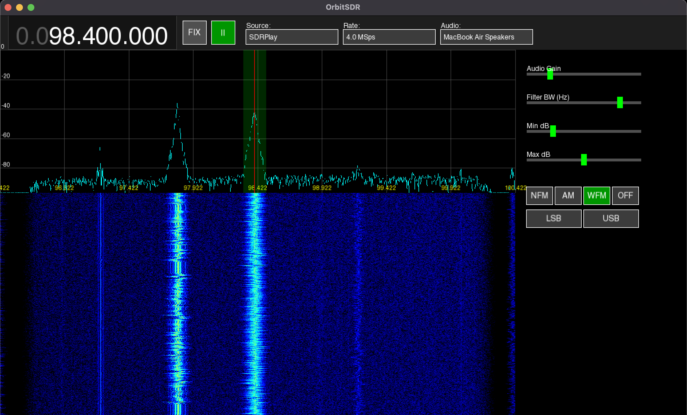

# OrbitSDR

A lightweight, high-performance SDR receiver built with C++17 and SFML, featuring AM/FM/SSB demodulation and support for RTL-SDR and SDRPlay on macOS and Linux.

## ⚠️ Current Status: Very Early Access (Pre-Alpha)

Please note that this project is in a very early stage of development. It is currently tested primarily on **macOS** (Apple Silicon) and **Linux**. Windows support is planned but not yet fully verified.

### Known Limitations / To-Do:
* **RTL-SDR:** No support for *Direct Sampling* mode yet (required for HF frequencies on standard dongles).
* **SDRPlay (RSPdx/1A/2):** Basic support only. Antenna selection (e.g., Ant A/B/C) and hardware filter configuration (Notch/DAB/MW) are not yet implemented.



---

## 🛠️ Prerequisites

The project depends on **SFML 3.0** for graphics/windowing and **miniaudio** for audio (included).

### Required Libraries

- C++17 compiler (GCC, Clang, MSVC)
- SFML **3.0** (Graphics, Window, System)
- `librtlsdr` (for RTL-SDR support)
- SDRPlay API **3.07+** (optional)

---

## 🍎 Building on macOS (Apple Silicon & Intel)

### 1. Install Dependencies (Homebrew)

```bash
brew install sfml
brew install librtlsdr
```

### 2. (Optional) Install SDRPlay API  
Download API 3.x from the SDRPlay website and install it.

### 3. Build

```bash
chmod +x build.sh
./build.sh
```

The script will ask whether to enable SDRPlay support (`y` / `n`).

---

## 🐧 Building on Linux (Ubuntu/Debian/Mint)

### 1. Install Dependencies

```bash
sudo apt update
# Ensure SFML 3.0 is available — otherwise build from source
sudo apt install build-essential libsfml-dev librtlsdr-dev zenity
```

### 2. (Optional) Install SDRPlay API

```bash
chmod +x SDRplay_RSP_API-Linux-3.xx.run
./SDRplay_RSP_API-Linux-3.xx.run
```

### 3. Build

```bash
chmod +x build.sh
./build.sh
```

---

## 🪟 Building on Windows 

Coming soon... (hopefully)

---

## ⚠️ Troubleshooting

### **“SDRPlay API Open Failed”**
Ensure `sdrplay_apiService` daemon is running.

### **“Overflow” (in console)**
Your CPU/GPU cannot process the UI + DSP at the chosen sample rate.  
Lower the **Sample Rate**.

### **File playback too fast**
Audio device might have failed to initialize; DSP loop times itself on audio buffer backpressure.