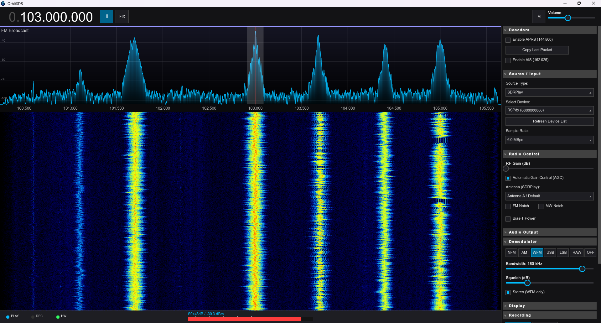

# OrbitSDR

A lightweight, multiplatform SDR software built with C++17 and SFML. 


Please note that this project is in a very early stage of development. It is currently tested primarily on **macOS** (Apple Silicon) but supports Linux and Windows. 

**Development builds** (artifacts) are available in the [GitHub Actions](https://github.com/krzysztofchojka/OrbitSDR/actions) tab (requires GitHub account).



## Features

- **Hardware Support:**
  - **SDRPlay (build with API 3.15):** Support includes **Notch Filters**, **Antenna Port selection**, and **Bias-T**.
  - **RTL-SDR:** Supports standard operation and **Direct Sampling** mode.
  - Sound card as baseband source.
- **Baseband Player:** Play raw IQ `.wav` files with a seekable timeline slider to analyze recordings (for now only 16-bit PCM is supported).
- **Integrated APRS:** Built-in AX.25 packet decoder with a live dashboard for messages and GPS telemetry (more digital modes planned).
- **Recording:** Record both demodulated Audio or raw Baseband IQ data.
- **Smooth UX:** Responsive waterfall with drag-to-tune, axis panning, and frequency snapping.
- **Demodulation:** Supports AM, NFM, LSB/USB, and WFM Stereo.

### To-Do / Known Limitations

- **Decoders:** Currently only APRS (AX.25) is supported, more digital decoders will be added in future updates.
- Add support for 32-bit Float baseband recordings.

---

### SDRPlay Requirements
To use SDRPlay devices, you must have the **SDRPlay API (Service)** installed on your system.
* **Tested Version:** This software is developed and tested with **API 3.15**.
* **Compatibility:** Other versions (e.g., 3.07 or newer 3.x releases) might work, but stability is not guaranteed.
* **Download:** You can get the API drivers from the [SDRPlay Downloads page](https://www.sdrplay.com/downloads/).


## Building on macOS
### 1. Install Dependencies (Homebrew):
```sh
brew install sfml
brew install librtlsdr
```
### 2. Build
```sh
chmod +x build.sh
./build.sh
```
*The script will ask if you want to link SDRPlay libraries.*

## Building on Linux
### 1. Install Dependencies (Ubuntu/Debian):
```sh
sudo apt update
# Note: Ensure you install SFML 3.0. If your repo has 2.x, build SFML from source.
sudo apt install build-essential libsfml-dev librtlsdr-dev zenity
```
### 2. Build
```sh
chmod +x build.sh
./build.sh
```
*The script will ask if you want to link SDRPlay libraries.*
<br>
### Windows Users
---
For Windows, I recommend downloading the pre-compiled artifact from the Releases or Actions tab.
Manual Compilation instructions for building from source on Windows are not yet documented. The automated builds use standard MSVC environment.